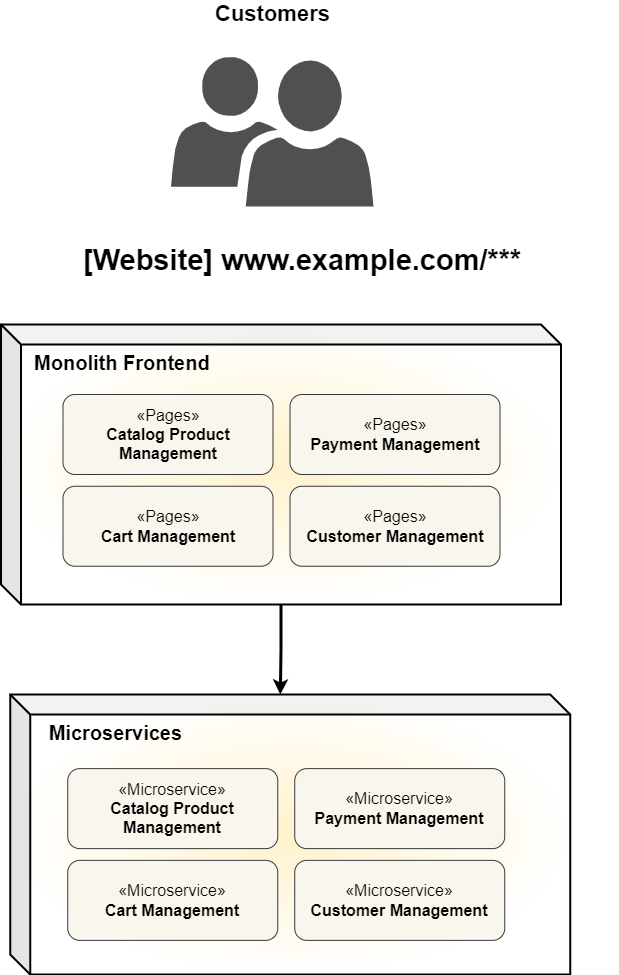
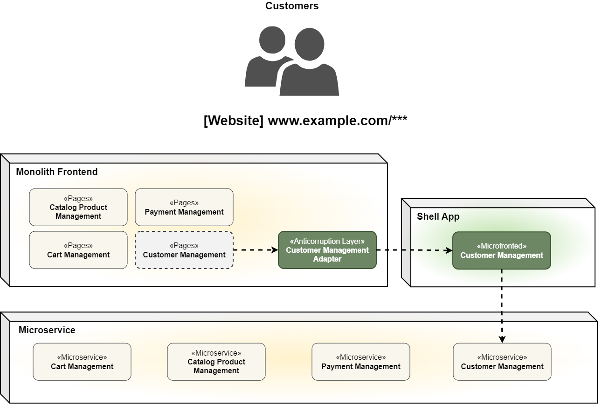
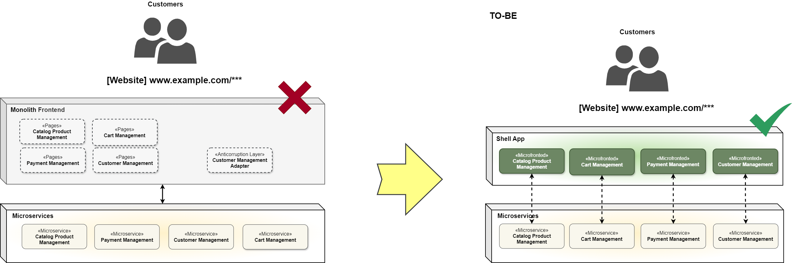
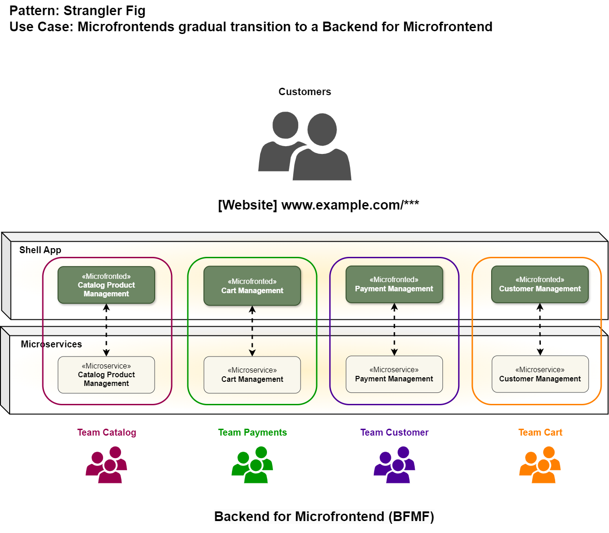

# Strangler Fig in Microfrontends: Gradual Transition to a Backend for Microfrontend

## Overview
The modernization of a monolithic frontend architecture to microfrontends is a challenge that requires a well-planned strategy to avoid service disruptions and minimize risks. The **Strangler Fig** pattern offers a progressive approach, allowing for the gradual replacement of monolithic parts with new microfrontend implementations without affecting the user experience.

## Why Start with a Monolith?
When starting a software project, we have several alternatives for designing its architecture. In the early stages, it is common to prioritize cost reduction and the operational efficiency of the team to deliver value effectively. For this reason, opting for a **monolithic architecture** is often a reasonable decision. A monolith is not inherently a bad practice, as it can have a well-organized and maintainable internal structure.

However, as the organization grows and expands its functionalities, capabilities, and processes, it becomes essential to optimize and manage change within the IT landscape. To achieve this, various strategies enable the **evolution from a monolith to more modular and scalable architectures**.

## Migration Strategy
In this repository, we focus on transforming a monolithic frontend using the **Strangler Fig** pattern, enabling a gradual transition toward a **Backend for Microfrontend (BFMF)** model.

### Use Case
Let's start with an example of a project that currently has a **monolithic frontend** exposed through the domain `example.com`, which is accessible to the organization's customers. On the backend side, the architecture can be structured using **microservices** or **API gateways**—any method works well in this context.

### Step-by-Step Migration
1. **Plan the Migration**: Define a logical separation strategy to migrate functionalities step by step.
2. **Introduce an App Shell**: The **App Shell** will act as the orchestrator for the new version of the project.
3. **Develop the First Microfrontend**: We start by creating the `Customer Management` microfrontend, which will be integrated into the monolith.
4. **Implement an Anti-Corruption System**: This system is essential to disable `Customer Management` functionalities in the monolith and delegate them to the new microfrontend.
5. **Iterate and Expand**: Over multiple iterations, more functionalities are extracted until achieving a **TO-BE** architecture.

## Target Architecture (TO-BE)
After several iterations, we can achieve a **TO-BE** architecture, as shown in the following diagram (to be added). Key characteristics include:
- **App Shell as the Core**: The **App Shell** mounts the same domain previously used by the monolith.
- **Separation of Responsibilities**: A clear distinction between frontend and backend functionalities.
- **Scalability and Modularity**: Components are independently deployable and scalable.

## Scaling with Backend for Microfrontend (BFMF)
Beyond simply applying the **Strangler Fig** pattern, the **TO-BE** architecture reveals a clear **separation of responsibilities** at the system level. At this stage, we can **strategically scale operations** and **accelerate development** by specializing each system domain.

### Team Structure
We define four internal teams responsible for managing specific sections of the system:
- **Team Catalog**
- **Team Payments**
- **Team Customer**
- **Team Cart**

Each team oversees a specific functionality **from frontend to backend**, effectively implementing the **Backend for Microfrontend (BFMF) pattern**. This approach ensures:
- **Independent Deployments**: Each component can be updated and deployed separately.
- **Scalability**: The architecture can support growing business needs.
- **Cross-Project Integration**: Components can be reused across different organizational projects.
- **Controlled Evolution**: Gradual enhancements without disrupting existing functionalities.

## Conclusion
By leveraging the **Strangler Fig** pattern and transitioning to a **Backend for Microfrontend (BFMF)** model, organizations can efficiently modernize their frontend architecture while maintaining stability and scalability. This approach minimizes risk, optimizes team workflows, and enables long-term architectural flexibility.

---

### Next Steps
- Provide example implementations for key components.
- Define CI/CD strategies for seamless deployment.

For contributions and feedback, feel free to open an issue or submit a pull request!

---

**Author:** [Bryan Mamani Jallurana]  